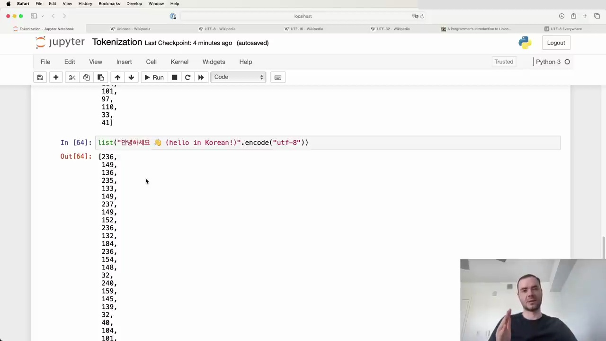
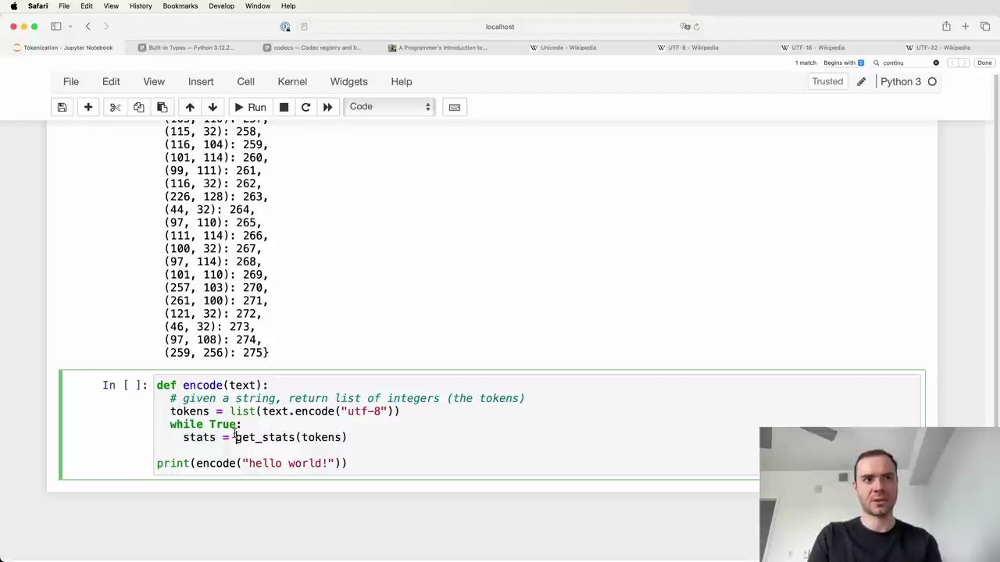

# [1) Understanding Tokenization in Large Language Models](https://www.youtube.com/watch?v=zduSFxRajkE&t=0s)


Tokenization is a crucial yet often frustrating part of working with large language models (LLMs). Despite its complexity, understanding tokenization is essential as many odd behaviors in LLMs can be traced back to it.


### What is Tokenization?


In the context of LLMs, tokenization is the process of converting a string of text into a sequence of tokens, which are the fundamental units that the model processes. In a previous video, we implemented a simple character-level tokenizer for a Shakespeare dataset. Here’s a brief overview of that process:


1. **Loading the Dataset**: We started with a large string of text.

2. **Creating a Vocabulary**: We identified 65 unique characters in the text.

3. **Mapping Characters to Tokens**: Each character was mapped to an integer token.

4. **Encoding Text**: The text was converted into a sequence of these integer tokens.


<a href="https://www.youtube.com/watch?v=zduSFxRajkE&t=60s">Link to video</a>


### Embedding Tokens


Once we have the tokens, they are fed into the language model using an embedding table. For example, with 65 possible tokens, the embedding table has 65 rows. Each token's integer value is used to look up a corresponding row in this table, which contains trainable parameters. These parameters are then used as input to the Transformer model.


### Advanced Tokenization Techniques


In practice, state-of-the-art LLMs use more sophisticated tokenization schemes, such as Byte Pair Encoding (BPE). These methods work on chunks of characters rather than individual characters, creating a more efficient and effective tokenization process.


### Tokenization in Research Papers


The GPT-2 paper introduced byte-level encoding for tokenization. It describes a tokenizer with a vocabulary of 50,257 tokens and a context size of 1,024 tokens. This means each token in the attention layer of the Transformer model can attend to up to 1,024 previous tokens.


<a href="https://www.youtube.com/watch?v=zduSFxRajkE&t=180s">Link to video</a>


Similarly, the Llama 2 paper mentions training on two trillion tokens, highlighting the importance of tokenization in large-scale models.


### Common Issues with Tokenization


Tokenization is at the heart of many peculiarities in LLMs. Here are some common issues:


- **Spelling Errors**: LLMs often struggle with spelling due to tokenization.

- **String Processing**: Simple string manipulations can be difficult for LLMs.

- **Non-English Languages**: Performance can degrade significantly for non-English languages.

- **Arithmetic**: LLMs may perform poorly on arithmetic tasks.

- **Trailing Whitespace**: Warnings about trailing whitespace are often tokenization issues.

- **Data Structure Preferences**: Recommendations to use YAML over JSON can be related to tokenization.


### Example of Tokenization Issues


Here’s an example string and its tokenization:


```

Tokenization is at the heart of much weirdness of LLMs. Do not brush it off.


127 + 677 = 804

1275 + 6773 = 8041


Egg.

I have an Egg.

egg.

EGG.


만나서 반가워요. 저는 OpenAI에서 개발한 대규모 언어 모델인 ChatGPT입니다. 궁금한 것이 있으시면 무엇이든 물어보세요.

```


Tokenization can lead to unexpected behaviors, such as difficulty in handling different cases of the word "egg" or issues with non-English text.


### Conclusion


Tokenization is a complex but essential part of working with LLMs. Understanding its intricacies can help diagnose and resolve many issues that arise when using these models. In future posts, we will delve deeper into advanced tokenization techniques like Byte Pair Encoding and their implementation.


<a href="https://www.youtube.com/watch?v=zduSFxRajkE&t=300s">Link to video</a>
# [2) Exploring Tokenization in Language Models](https://www.youtube.com/watch?v=zduSFxRajkE&t=350s)


Tokenization is at the heart of much of the weirdness in large language models (LLMs). Do not brush it off.


### Common Issues Attributed to Tokenization


- **Why can't LLMs spell words?** Tokenization.

- **Why can't LLMs do simple string processing tasks like reversing a string?** Tokenization.

- **Why are LLMs worse at non-English languages (e.g., Japanese)?** Tokenization.

- **Why are LLMs bad at simple arithmetic?** Tokenization.

- **Why did GPT-2 have more trouble coding in Python?** Tokenization.

- **Why did my LLM abruptly halt when it sees the string `<endoftext>`?** Tokenization.

- **What is this weird warning I get about a "trailing whitespace"?** Tokenization.

- **Why do LLMs break if I ask it about "SolidGoldMagikarp"?** Tokenization.

- **Why should I prefer to use YAML over JSON with LLMs?** Tokenization.

- **Why is LLM not actually end-to-end language modeling?** Tokenization.

- **What is the real root of suffering?** Tokenization.


### Example: Tokenization in Action


A good tokenization web app: [https://tiktokenizer.vercel.app](https://tiktokenizer.vercel.app)


#### Example String


```plaintext

Tokenization is at the heart of much weirdness of LLMs. Do not brush it off.


127 + 677 = 804

1275 + 6773 = 8041


Egg.

I have an Egg.

egg.

EGG.


만나서 반가워요. 저는 OpenAI에서 개발한 대규모 언어 모델인 ChatGPT입니다. 궁금한 것이 있으시면 무엇이든 물어보세요.


for i in range(1, 101):

    if i % 3 == 0 and i % 5 == 0:

        print("FizzBuzz")

    elif i % 3 == 0:

        print("Fizz")

    elif i % 5 == 0:

        print("Buzz")

    else:

        print(i)

```


### Tokenization in Different Contexts


#### Arithmetic


- `127 + 677 = 804` is tokenized differently than `1275 + 6773 = 8041`.

- Single tokens for smaller numbers, multiple tokens for larger numbers.


#### Text Examples


- The word "egg" can be tokenized differently based on its context:

  - `"Egg."` becomes two tokens.

  - `"I have an egg."` becomes a single token for "egg".

  - `"egg."` and `"EGG."` are tokenized differently due to case sensitivity.


#### Non-English Languages


- Non-English languages like Korean or Japanese often result in more tokens for the same sentence compared to English.

- This increases the sequence length and can lead to running out of context in the Transformer model.


#### Python Code


- Python code with spaces and indentation can be very wasteful in terms of tokens.

- Each space can be a separate token, leading to inefficiency.


### Tokenizer Comparison


#### GPT-2 Tokenizer


- Token count for a given string: 300 tokens.


#### GPT-4 Tokenizer


- Token count for the same string: 185 tokens.

- More efficient handling of whitespace and indentation in Python code.


<a href="https://www.youtube.com/watch?v=zduSFxRajkE&t=830s">Link to video</a>


### Conclusion


The design of the tokenizer significantly impacts the performance and efficiency of LLMs. Improvements in tokenization, such as those seen in the GPT-4 tokenizer, can lead to better handling of languages, arithmetic, and coding tasks. Understanding and optimizing tokenization is crucial for advancing the capabilities of LLMs.
# [3) Tokenization in Language Models](https://www.youtube.com/watch?v=zduSFxRajkE&t=896s)


Let's now start writing some code. Remember, we want to take strings and feed them into language models. For that, we need to tokenize strings into integers within a fixed vocabulary. These integers will be used to look up vectors in a table, which will then be fed into the Transformer as input.


### Supporting Multiple Languages and Characters


The process gets tricky because we don't just want to support the simple English alphabet. We want to support different kinds of languages. For example, "안녕하세요" in Korean, which means "hello," and various special characters like emojis.


### Strings in Python


In Python, strings are immutable sequences of Unicode code points. According to the [Python documentation](https://docs.python.org/3/library/stdtypes.html#text-sequence-type-str):


> Textual data in Python is handled with `str` objects, or strings. Strings are immutable sequences of Unicode code points.


### Unicode Code Points


Unicode code points are defined by the Unicode Consortium as part of the Unicode standard. This standard defines roughly 150,000 characters across 161 scripts. The latest standard, as of September 2023, is version 15.1.


### Accessing Unicode Code Points in Python


We can access the Unicode code point for a given character using the `ord` function in Python. For example:


```python

ord('H')  # Output: 72

```


For more complex characters, such as emojis, the code points can be significantly higher:


```python

ord('😊')  # Output: 128522

```


However, the `ord` function only works with single characters. To get the code points for a string, we can use a list comprehension:


```python

[ord(char) for char in "안녕하세요"]  # Output: [50504, 45397, 54616, 49464, 50836]

```


### Challenges with Using Raw Code Points


While we have already turned raw code points into integers, using these integers directly as tokens is not ideal. The vocabulary would be quite large (around 150,000 code points), and the Unicode standard is constantly evolving, making it an unstable representation.


### Example Code


Here is an example of how we can tokenize a string in Python:


```python

for i in range(1, 101):

    if i % 3 == 0 and i % 5 == 0:

        print("FizzBuzz")

    elif i % 3 == 0:

        print("Fizz")

    elif i % 5 == 0:

        print("Buzz")

    else:

        print(i)

```


In this example, we see how different strings and characters are tokenized and counted, demonstrating the complexity and necessity of effective tokenization in language models.
# [4) Understanding Unicode Encodings](https://www.youtube.com/watch?v=zduSFxRajkE&t=1095s)


To find a better way to handle text, we turn to encodings. The Unicode Consortium defines three types of encodings: UTF-8, UTF-16, and UTF-32. These encodings allow us to take Unicode text and translate it into binary data or byte streams.


### UTF-8 Encoding


UTF-8 is by far the most common encoding. It takes every single code point and translates it into a byte stream that is between one to four bytes in length. This variable-length encoding depends on the Unicode point, resulting in 1 to 4 bytes for each code point.


### UTF-16 and UTF-32 Encodings


UTF-16 and UTF-32 are other types of encodings. UTF-32 is fixed-length, which can be advantageous, but it has many downsides. The full spectrum of pros and cons of these encodings is beyond the scope of this discussion. However, it's worth noting that UTF-8 is significantly preferred and more prominently used on the internet. One major advantage of UTF-8 is its backward compatibility with the simpler ASCII encoding of text.


### Encoding Strings in Python


Let's try encoding a string into UTF-8 using Python. The string class in Python has an `encode` method where you can specify the encoding, such as UTF-8.


```python

"안녕하세요 👋 (hello in Korean!)".encode("utf-8")

```


<a href="https://www.youtube.com/watch?v=zduSFxRajkE&t=1215s">Link to video</a>


The output is a bytes object, which isn't very readable. To get a better view, we can convert it to a list to see the raw bytes representing the string according to the UTF-8 encoding.


```python

list("안녕하세요 👋 (hello in Korean!)".encode("utf-8"))

```




<a href="https://www.youtube.com/watch?v=zduSFxRajkE&t=1335s">Link to video</a>


### Comparing Encodings


We can also look at UTF-16 and UTF-32 encodings. For UTF-16, the byte stream is slightly different, and we start to see one of its disadvantages: it can be wasteful for simple ASCII characters.


```python

list("안녕하세요 👋 (hello in Korean!)".encode("utf-16"))

```


For UTF-32, the encoding is even more wasteful, with many zeros followed by some data.


```python

list("안녕하세요 👋 (hello in Korean!)".encode("utf-32"))

```


### Choosing the Right Encoding


For our purposes, we prefer to stick with UTF-8. However, using UTF-8 naively results in a byte stream with a vocabulary length of only 256 possible tokens. This small vocabulary size means our text would be stretched over very long sequences of bytes, which is inefficient.


To address this, we turn to the Byte Pair Encoding (BPE) algorithm, which allows us to compress these byte sequences to a variable amount. This helps us support a larger vocabulary size while sticking with the UTF-8 encoding of strings.


In summary, while UTF-8 is the preferred encoding due to its efficiency and compatibility, using it directly can be inefficient for certain tasks. The Byte Pair Encoding algorithm provides a solution by compressing byte sequences, making it more practical for use in tasks like next-token prediction in transformers.
# [5) Tokenization-Free Language Models](https://www.youtube.com/watch?v=zduSFxRajkE&t=1367s)


### The Challenge of Raw Byte Sequences


Feeding raw byte sequences directly into language models is an intriguing idea. In fact, there was a paper published last summer that explored this possibility. However, implementing this approach requires significant modifications to the Transformer architecture.


### The Problem with Attention Mechanisms


The primary issue is that attention mechanisms become extremely expensive with long sequences. The paper proposes a hierarchical structuring of the Transformer to address this problem, allowing raw bytes to be fed directly into the model.


### Hierarchical Structuring of Transformers


The hierarchical structuring aims to make tokenization-free autoregressive sequence modeling viable at scale. This would be a significant breakthrough, enabling us to feed byte streams directly into our models without the need for tokenization.


### Current Limitations


Despite the promising results, this approach has not yet been proven by a sufficient number of groups or at a sufficient scale. Therefore, we still rely on tokenization methods like Byte Pair Encoding (BPE) to compress data before feeding it into language models.


### Byte Pair Encoding (BPE)


Let's see how Byte Pair Encoding works. Below is an example of encoding a Korean greeting using UTF-8.


<a href="https://www.youtube.com/watch?v=zduSFxRajkE&t=1367s">Link to video</a>


```python

list("안녕하세요 👋 (hello in Korean!)".encode("utf-8"))

```


The output is a list of byte values representing the encoded string:


```plaintext

[236, 149, 136, 235, 133, 149, 237, 149, 152, 236, 132, 184, 236, 154, 148, 32, 240, 159, 145, 139, 32, 40, 104, 101, 108, 108, 111, 32, 105, 110, 32, 75, 111, 114, 101, 97, 110, 33, 41]

```


This demonstrates how BPE can be used to compress and encode text data before it is fed into a language model.
# [6) Byte Pair Encoding Algorithm](https://www.youtube.com/watch?v=zduSFxRajkE&t=1430s)


The byte pair encoding (BPE) algorithm is a simple yet effective method for data compression. The basic idea is to iteratively replace the most frequent pair of bytes (or tokens) in a sequence with a new byte that is not in the original dataset. This process continues until no more pairs can be found, effectively compressing the data.


### Example of Byte Pair Encoding


Consider an input sequence with a vocabulary of four elements: `a`, `b`, `c`, and `d`. The sequence is too long, and we want to compress it. Here's how the BPE algorithm works step-by-step:


1. **Initial Sequence**:

   ```

   aaabdaaabac

   ```


2. **First Iteration**:

   - The byte pair `aa` occurs most frequently.

   - Replace `aa` with a new token `Z`.

   - Updated sequence:

     ```

     ZabdZabac

     ```

   - Vocabulary: `a, b, c, d, Z`


3. **Second Iteration**:

   - The byte pair `ab` occurs most frequently.

   - Replace `ab` with a new token `Y`.

   - Updated sequence:

     ```

     ZYdZYac

     ```

   - Vocabulary: `a, b, c, d, Z, Y`


4. **Third Iteration**:

   - The byte pair `ZY` occurs most frequently.

   - Replace `ZY` with a new token `X`.

   - Updated sequence:

     ```

     XdXac

     ```

   - Vocabulary: `a, b, c, d, Z, Y, X`


After these iterations, the original sequence of 11 characters with a vocabulary size of 4 has been compressed to a sequence of 5 characters with a vocabulary size of 7.


### Implementation in Python


Let's implement the BPE algorithm in Python. Below is an example of encoding a string using UTF-8 and converting it to a list of byte values.


```python

list("만녕하세요 👋 (hello in Korean!)".encode("utf-8"))

```


<a href="https://www.youtube.com/watch?v=zduSFxRajkE&t=1430s">Link to video</a>


### Wikipedia Example


The Wikipedia page on byte pair encoding provides a detailed example of the algorithm. Here's a snapshot of the example:


<a href="https://www.youtube.com/watch?v=zduSFxRajkE&t=1490s">Link to video</a>


The process involves iteratively replacing the most common contiguous sequences of characters with unused 'placeholder' bytes. This continues until no more sequences can be found, leaving the text effectively compressed.


### Final Sequence


After multiple iterations, the final sequence is significantly compressed, and the vocabulary size has increased due to the newly minted tokens.


<a href="https://www.youtube.com/watch?v=zduSFxRajkE&t=1550s">Link to video</a>


This data cannot be compressed further by byte pair encoding because there are no pairs of bytes that occur more than once. To decompress the data, simply perform the replacements in the reverse order.


### References


For more information, you can refer to the following resources:

- [Re-Pair](https://en.wikipedia.org/wiki/Re-Pair)

- [Sequitur Algorithm](https://en.wikipedia.org/wiki/Sequitur_algorithm)


By understanding and implementing the BPE algorithm, we can efficiently compress data and create an algorithm for encoding and decoding sequences.
# [7) Tokenization and Byte Pair Encoding](https://www.youtube.com/watch?v=zduSFxRajkE&t=1622s)


In this section, we will explore how to tokenize text and apply byte pair encoding (BPE) to compress data. Let's dive into the process step-by-step.


### Initial Text and Tokenization


First, we start with a block of text. For this example, I copied the first paragraph from a blog post and pasted it into a variable named `text`. This text is a single long line.


To get the tokens, we encode the text into UTF-8. The tokens at this point will be a raw stream of bytes. To make it easier to work with, we convert these bytes into integers and create a list. This allows us to manipulate and visualize the data in Python more effectively.


Here is the code snippet for this process:


```python

tokens = list(map(int, text.encode('utf-8')))  # Convert to a list of integers in range 0..255 for convenience

print('---')

print(text)

print("length:", len(text))

print('---')

print(tokens)

print("length:", len(tokens))

```


### Output


The original paragraph has a length of 533 code points. When encoded in UTF-8, it results in 616 bytes (or tokens). The increase in size is due to the fact that simple ASCII characters become a single byte, while more complex Unicode characters can take up to four bytes.


<a href="https://www.youtube.com/watch?v=zduSFxRajkE&t=1682s">Link to video</a>


### Finding the Most Common Byte Pair


The next step in the algorithm is to iterate over the byte stream and find the pair of bytes that occur most frequently. We will then merge this pair. If you are following along in a Jupyter notebook, I encourage you to try writing this function yourself. Otherwise, here is the implementation of the function that finds the most common pair:


```python

from collections import Counter


def find_most_common_pair(tokens):

    pairs = Counter(zip(tokens, tokens[1:]))

    return pairs.most_common(1)[0]


most_common_pair = find_most_common_pair(tokens)

print("Most common pair:", most_common_pair)

```


This function uses the `Counter` class from the `collections` module to count the occurrences of each byte pair and returns the most common one.


### Example of Byte Pair Encoding


To illustrate byte pair encoding, let's consider an example. Suppose we have the following data and replacement table:


```

aaabdaaabac

```


The byte pair "aa" occurs most often, so it will be replaced by a byte that is not used in the data, such as "Z". The process is repeated with the byte pair "ab", replacing it with "Y":


```

ZabdZabac

Z=aa

Y=ab

```


Finally, the only literal byte pair left occurs only once, and the encoding might stop here. Alternatively, the process could continue with recursive byte pair encoding, replacing "ZY" with "X":


```

XdXac

X=ZY

Y=ab

Z=aa

```


This data cannot be compressed further by byte pair encoding because there are no pairs of bytes that occur more than once.


<a href="https://www.youtube.com/watch?v=zduSFxRajkE&t=1622s">Link to video</a>


To decompress the data, simply perform the replacements in the reverse order.


By following these steps, you can effectively tokenize text and apply byte pair encoding to compress data.
# [8) Implementing Tokenization Statistics](https://www.youtube.com/watch?v=zduSFxRajkE&t=1715s)


In this section, we will discuss a method to compute statistics on tokenized text data. The goal is to identify the most frequently occurring consecutive pairs of tokens.


### Function Definition


We start by defining a function `get_stats` that takes a list of integers (tokens) as input and returns a dictionary with counts of consecutive token pairs.


```python

def get_stats(ids):

    counts = {}

    for pair in zip(ids, ids[1:]):  # Pythonic way to iterate consecutive elements

        counts[pair] = counts.get(pair, 0) + 1

    return counts

```


### Computing Statistics


Next, we call this function on our list of tokens to get the statistics. The dictionary `stats` will have tuples of consecutive elements as keys and their counts as values.


```python

stats = get_stats(tokens)

```


### Sorting and Displaying Results


To display the results in a more readable format, we sort the dictionary by values in descending order and print the sorted list.


```python

print(sorted(((v, k) for k, v in stats.items()), reverse=True))

```


This code snippet sorts the dictionary items by their counts and prints them. The most common consecutive pair will appear first.


<a href="https://www.youtube.com/watch?v=zduSFxRajkE&t=1775s">Link to video</a>


### Example Analysis


From the output, we observe that the pair `(101, 32)` is the most frequently occurring consecutive pair, appearing 20 times. To understand what this pair represents, we can convert the Unicode code points back to characters.


```python

print(chr(101), chr(32))  # Output: 'e' ' '

```


This indicates that the most common pair is 'e' followed by a space, suggesting that many words in the text end with the letter 'e'.


### Conclusion


By using this method, we can efficiently identify and analyze the most common consecutive token pairs in a text dataset. This can be particularly useful for tasks such as text compression, language modeling, and more.
# [9) Implementing Token Merging in Python](https://www.youtube.com/watch?v=zduSFxRajkE&t=1836s)


In this section, we will implement a function to merge the most common token pairs in a sequence. We will create a new token with an ID of 256 and replace every occurrence of the most common pair with this new token.


### Identifying the Most Common Pair


First, we need to identify the most common pair in our sequence. We can achieve this by using the `max` function on our dictionary of token pairs, `stats`, and providing a custom ranking function.


```python

top_pair = max(stats, key=stats.get)

top_pair

```


This will return the pair `(101, 32)` as the most common pair.


### Merging the Most Common Pair


Next, we will implement a function to merge the most common pair in the sequence. The function will iterate through the list of token IDs and replace every occurrence of the pair with the new token ID `256`.


```python

def merge(ids, pair, idx):

    # In the list of ints (ids), replace all consecutive occurrences of pair with the new token idx

    newids = []

    i = 0

    while i < len(ids):

        # If we are not at the very last position AND the pair matches, replace it

        if i < len(ids) - 1 and ids[i] == pair[0] and ids[i + 1] == pair[1]:

            newids.append(idx)

            i += 2

        else:

            newids.append(ids[i])

            i += 1

    return newids


# Example usage

print(merge([5, 6, 6, 7, 9, 1], (6, 7), 99))

```


This will output:


```python

[5, 6, 99, 9, 1]

```


### Applying the Merge Function


Now, we will apply the merge function to our actual use case. We will replace the most common pair `(101, 32)` with the new token ID `256`.


```python

tokens2 = merge(tokens, top_pair, 256)

print(tokens2)

print("length:", len(tokens2))

```


<a href="https://www.youtube.com/watch?v=zduSFxRajkE&t=1956s">Link to video</a>


After running this, we observe that the length of the sequence has decreased from 616 to 596, indicating that 20 occurrences of the pair `(101, 32)` have been replaced by `256`.


### Iterating the Process


To further optimize the sequence, we will iterate this process. We will repeatedly find the most common pair and replace it until we reach a desired vocabulary size or sequence length. This is a hyperparameter that can be tuned based on the specific requirements of the model.


```python

# Pseudocode for iterative merging

while condition:

    top_pair = max(stats, key=stats.get)

    tokens = merge(tokens, top_pair, new_token_id)

    new_token_id += 1

    # Update stats and other necessary variables

```


In practice, models like GPT-4 use around 100,000 tokens, and finding the optimal vocabulary size is crucial for performance.


By iterating these steps, we can efficiently reduce the sequence length and optimize the token vocabulary for our language model.
# [10) Tokenization Process in Python](https://www.youtube.com/watch?v=zduSFxRajkE&t=2098s)


In this section, we will discuss the process of tokenization using Python, focusing on the implementation of byte pair encoding (BPE) to compress text data.


### Preparing the Text Data


Before diving into the main loop, we need to prepare our text data. Instead of using a short paragraph, we use a longer text to get more representative statistics for the byte pairs. This approach yields more sensible results.


```python

# Raw text encoded into bytes using UTF-8 encoding

raw_text = "..."  # Your long text here

encoded_text = raw_text.encode('utf-8')


# Convert bytes to a list of integers

tokens = list(encoded_text)

```


### Defining the Merge Functions


We define two functions: `get_stats` to count the occurrences of byte pairs and `merge` to perform the merging of byte pairs.


```python

def get_stats(ids):

    counts = {}

    for pair in zip(ids, ids[1:]):

        counts[pair] = counts.get(pair, 0) + 1

    return counts


def merge(ids, pair, idx):

    newids = []

    i = 0

    while i < len(ids):

        if i < len(ids) - 1 and ids[i] == pair[0] and ids[i+1] == pair[1]:

            newids.append(idx)

            i += 2

        else:

            newids.append(ids[i])

            i += 1

    return newids

```


### Setting Hyperparameters and Initializing Variables


We set the desired final vocabulary size and initialize necessary variables.


```python

vocab_size = 276  # Desired final vocabulary size

num_merges = vocab_size - 256  # Number of merges to perform

ids = list(tokens)  # Copy of the tokens list

merges = {}  # Dictionary to store merge operations

```


### Performing the Merges


We perform the merges iteratively, updating the token list and recording the merges.


```python

for i in range(num_merges):

    stats = get_stats(ids)

    pair = max(stats, key=stats.get)

    idx = 256 + i

    print(f"merging {pair} into a new token {idx}")

    ids = merge(ids, pair, idx)

    merges[pair] = idx

```


<a href="https://www.youtube.com/watch?v=zduSFxRajkE&t=2158s">Link to video</a>


### Analyzing the Results


After performing the merges, we analyze the compression ratio achieved.


```python

print("tokens length:", len(tokens))

print("ids length:", len(ids))

print(f"compression ratio: {len(tokens) / len(ids):.2f}X")

```


<a href="https://www.youtube.com/watch?v=zduSFxRajkE&t=2338s">Link to video</a>


In this example, we started with 24,597 tokens and reduced it to 19,438 tokens after 20 merges, achieving a compression ratio of approximately 1.27X.


### Conclusion


By using byte pair encoding, we can effectively compress text data, reducing the number of tokens while maintaining the integrity of the original text. This method is particularly useful in natural language processing tasks where efficient tokenization is crucial.
# [11) Training the Tokenizer](https://www.youtube.com/watch?v=zduSFxRajkE&t=2360s)


One important point to note is that the tokenizer is a completely separate object from the large language model (LLM) itself. Everything in this lecture focuses on training the tokenizer, not the LLM. The tokenizer is a pre-processing stage that usually runs independently.


### Tokenizer Training


The tokenizer has its own training set, which can be different from the training set of the LLM. The training set consists of documents on which the tokenizer is trained using the Byte Pair Encoding (BPE) algorithm. This process involves:


1. **Training the Vocabulary**: The tokenizer is trained on its dataset to build a vocabulary.

2. **Performing Byte Pair Encoding**: This algorithm helps in creating merges that are used for encoding and decoding text.


### Encoding and Decoding


Once the tokenizer is trained and the vocabulary and merges are established, it can perform both encoding and decoding. The tokenizer acts as a translation layer between raw text (a sequence of Unicode code points) and token sequences.


- **Encoding**: Converts raw text into a token sequence.

- **Decoding**: Converts a token sequence back into raw text.


<a href="https://www.youtube.com/watch?v=zduSFxRajkE&t=2420s">Link to video</a>


### Integration with Large Language Models


After training the tokenizer, the next step is to train the LLM. Typically, in state-of-the-art applications, all training data for the LLM is run through the tokenizer to translate everything into a massive token sequence. The raw text can then be discarded, and the LLM trains on the token sequences stored on disk.


### Importance of Separate Training Sets


The training sets for the tokenizer and the LLM can be different. For example, when training the tokenizer, it's important to consider performance across multiple languages and types of data (e.g., code vs. non-code). The diversity in the tokenizer's training set affects the number of merges and the density of different types of data in the token space.


- **Example**: If the tokenizer's training set includes a significant amount of Japanese data, more Japanese tokens will get merged, resulting in shorter sequences for Japanese text. This is beneficial for the LLM, which has a finite context length in the token space.


### Encoding and Decoding Steps


Now that the tokenizer is trained and we have the merges, we can proceed with encoding and decoding. This involves translating between raw text and token sequences, which is crucial for the subsequent training of the LLM.


```python

print("tokens length:", len(tokens))

print("ids length:", len(ids))

print(f"compression ratio: {len(tokens) / len(ids):.2f}X")

```


```

tokens length: 24597

ids length: 19438

compression ratio: 1.27X

```


Note: The tokenizer is a completely separate, independent module from the LLM. It has its own training dataset of text (which could be different from that of the LLM), on which you train the vocabulary using the Byte Pair Encoding (BPE) algorithm. It then translates back and forth between raw text and sequences of tokens. The LLM later only ever sees the tokens and never directly deals with any text.


<a href="https://www.youtube.com/watch?v=zduSFxRajkE&t=2480s">Link to video</a>
# [12) Decoding Token Sequences](https://www.youtube.com/watch?v=zduSFxRajkE&t=2567s)


In this section, we will discuss how to decode a token sequence back into a Python string object. This process involves using a tokenizer to convert raw text into a sequence of tokens and then decoding these tokens back into readable text.


### Implementing the Decoding Function


We start by implementing a function that takes a list of integers (token IDs) and returns a Python string. Here is one way to do it:


```python

vocab = {idx: bytes([idx]) for idx in range(256)}

for (p0, p1), idx in merges.items():

    vocab[idx] = vocab[p0] + vocab[p1]


def decode(ids):

    # Given ids (list of integers), return Python string

    tokens = b"".join(vocab[idx] for idx in ids)

    text = tokens.decode("utf-8")

    return text

```


### Explanation


1. **Vocabulary Mapping**: We create a dictionary `vocab` that maps token IDs to their corresponding byte objects. Initially, this dictionary contains raw bytes for tokens from 0 to 255. We then populate this dictionary by iterating over all the merges and concatenating the byte representations of the tokens.


2. **Decoding Function**: The `decode` function takes a list of token IDs, looks up their byte representations in the `vocab` dictionary, concatenates these bytes, and then decodes the concatenated bytes back into a Python string using UTF-8 encoding.


### Handling Errors in Decoding


One tricky aspect of decoding is handling invalid byte sequences. For example, if we try to decode the token ID `128`, we might encounter an error because it does not conform to the UTF-8 standard.


```python

def decode(ids):

    tokens = b"".join(vocab[idx] for idx in ids)

    text = tokens.decode("utf-8", errors="replace")

    return text

```


By setting `errors="replace"` in the `decode` function, we can replace invalid byte sequences with a special replacement character, ensuring that the decoding process does not fail.


### Example


Here is an example of decoding a token sequence:


```python

print(decode([128]))

```


This will output a replacement character if the token ID `128` does not conform to the UTF-8 standard.


### Visual Representation


<a href="https://www.youtube.com/watch?v=zduSFxRajkE&t=2567s">Link to video</a>


The diagram above illustrates the relationship between the LLM, the tokenizer, and the raw text. The tokenizer translates back and forth between raw text and sequences of tokens, while the LLM only deals with tokens.


### Conclusion


By implementing the decoding function and handling errors appropriately, we can ensure that our token sequences are correctly converted back into readable text. This process is crucial for working with large language models and understanding their outputs.


---


This concludes our discussion on decoding token sequences. In the next section, we will delve deeper into the intricacies of tokenization and its applications.
# [13) Encoding and Decoding with Byte Pair Encoding (BPE)](https://www.youtube.com/watch?v=zduSFxRajkE&t=2901s)


In this section, we will explore how to encode a string into tokens and decode tokens back into a string using Byte Pair Encoding (BPE). This process involves several steps, including encoding text into raw bytes, merging byte pairs, and decoding the tokens back into text.


### Encoding


To encode a string into tokens, we need to follow these steps:


1. **Encode the Text into UTF-8 Bytes**: Convert the text into a sequence of UTF-8 encoded bytes.

2. **Convert Bytes to List of Integers**: Transform the bytes into a list of integers, which represent the raw tokens.

3. **Merge Byte Pairs**: Use a predefined dictionary of merges to combine byte pairs into new tokens.


Here is the implementation of the encoding function:


```python

def encode(text):

    # Given a string, return list of integers (the tokens)

    tokens = list(text.encode("utf-8"))

    while True:

        stats = get_stats(tokens)

        pair = min(stats, key=lambda p: merges.get(p, float("inf")))

        if pair not in merges:

            break  # nothing else can be merged

        idx = merges[pair]

        tokens = merge(tokens, pair, idx)

    return tokens


print(encode("hello world!"))

```




<a href="https://www.youtube.com/watch?v=zduSFxRajkE&t=3021s">Link to video</a>


### Decoding


To decode a sequence of tokens back into text, we need to reverse the encoding process:


1. **Map Tokens to Bytes**: Use a vocabulary dictionary to map each token back to its corresponding byte sequence.

2. **Join Bytes and Decode**: Join the byte sequences and decode them back into a UTF-8 string.


Here is the implementation of the decoding function:


```python

vocab = {idx: bytes([idx]) for idx in range(256)}

for (p0, p1), idx in merges.items():

    vocab[idx] = vocab[p0] + vocab[p1]


def decode(ids):

    # Given ids (list of integers), return Python string

    tokens = b"".join(vocab[idx] for idx in ids)

    text = tokens.decode("utf-8", errors="replace")

    return text


print(decode([128]))

```


<a href="https://www.youtube.com/watch?v=zduSFxRajkE&t=2901s">Link to video</a>


### Handling Edge Cases


The initial implementation of the encoding function may fail for certain edge cases, such as when the input string is empty or contains only a single character. To handle these cases, we can add a check to ensure that the length of tokens is at least two before attempting to merge:


```python

def encode(text):

    tokens = list(text.encode("utf-8"))

    while len(tokens) >= 2:

        stats = get_stats(tokens)

        pair = min(stats, key=lambda p: merges.get(p, float("inf")))

        if pair not in merges:

            break

        idx = merges[pair]

        tokens = merge(tokens, pair, idx)

    return tokens


print(encode("h"))

```


### Testing the Implementation


To ensure the correctness of our encoding and decoding functions, we can run a few test cases:


1. **Round-Trip Encoding and Decoding**: Encode a string and then decode it back to verify that we get the original string.

2. **Validation Data**: Test the functions with text that the tokenizer has not seen before to ensure robustness.


```python

text2 = decode(encode("hello world!"))

print(text2 == "hello world!")


valtext = "Many common characters, including numerals, punctuation, and other symbols, are used."

valtext2 = decode(encode(valtext))

print(valtext2 == valtext)

```


<a href="https://www.youtube.com/watch?v=zduSFxRajkE&t=3381s">Link to video</a>


### Conclusion


We have implemented the basic Byte Pair Encoding algorithm, which allows us to encode and decode text using a predefined set of merges. This forms the foundation for more complex tokenization schemes used in state-of-the-art language models. In the next section, we will explore how these models use advanced tokenizers and how the process becomes more complex.
# [14) Understanding GPT-2 Tokenization](https://www.youtube.com/watch?v=zduSFxRajkE&t=3456s)


In this section, we will delve into the tokenization process used in GPT-2, particularly focusing on the Byte Pair Encoding (BPE) algorithm and how it is applied to UTF-8 encoded text.


### Byte Pair Encoding (BPE) in GPT-2


The GPT-2 paper from 2019 discusses the use of the BPE algorithm on byte-level representations of UTF-8 encoding. The motivation behind this approach is to handle common characters, including numerals, punctuation, and other symbols, in a unified manner within the standard.


### Handling Common Words and Punctuation


A challenge with naive BPE is that common words like "dog" can appear with various punctuation marks (e.g., "dog.", "dog!", "dog?"). Naively merging these can lead to suboptimal tokenization, where semantically different tokens are combined. To address this, GPT-2 enforces rules to prevent certain merges.


### Enforcing Tokenization Rules


GPT-2 uses a regex pattern to enforce these rules. The pattern ensures that certain characters, such as letters, numbers, and punctuation, are not merged inappropriately. Below is an example of how this pattern is applied:


```python

import regex as re


gpt2pat = re.compile(r"""'s|'t|'re|'ve|'m|'ll|'d| ?\p{L}+| ?\p{N}+| ?[^\p{L}\p{N}\s]+|\s+(?!\S)|\s+""")

print(re.findall(gpt2pat, "Hello world how are you"))

```


This code splits the input string into tokens based on the defined regex pattern.


### Example of Tokenization


Let's see how this pattern works with different inputs:


```python

print(re.findall(gpt2pat, "Hello world how are you"))

# Output: ['Hello', ' ', 'world', ' ', 'how', ' ', 'are', ' ', 'you']


print(re.findall(gpt2pat, "Hello've world123 how's are you!!!?"))

# Output: ['Hello', "'ve", ' ', 'world', '123', ' ', 'how', "'s", ' ', 'are', ' ', 'you', '!!!?']

```


### Real-World Example


Consider a piece of Python code:


```python

example = """

for i in range(1, 101):

    if i % 3 == 0 and i % 5 == 0:

        print("FizzBuzz")

    elif i % 3 == 0:

        print("Fizz")

    elif i % 5 == 0:

        print("Buzz")

    else:

        print(i)

"""

print(re.findall(gpt2pat, example))

```


This will split the code into tokens, ensuring that different categories (letters, numbers, punctuation) are handled separately.


### Conclusion


The regex pattern used in GPT-2's tokenization process is crucial for ensuring that certain merges do not occur, thereby maintaining the integrity of the text. This approach helps in handling various characters and symbols effectively, making the tokenization process more robust.


<a href="https://www.youtube.com/watch?v=zduSFxRajkE&t=3456s">Link to video</a>
# [15) Introduction to TikToken Library from OpenAI](https://www.youtube.com/watch?v=zduSFxRajkE&t=4298s)


The TikToken library from OpenAI is the official library for tokenization. This library is used for inference, not training, and supports tokenization for models like GPT-2 and GPT-4.


### Installation


To install the TikToken library, use the following command:


```bash

pip install tiktoken

```


### Tokenization


Using the TikToken library, you can tokenize text for both GPT-2 and GPT-4 models. The tokenization process for GPT-4 has some differences compared to GPT-2, particularly in how whitespace and numbers are handled.


### Differences in Tokenization Patterns


In GPT-2, whitespace remains unmerged, whereas in GPT-4, whitespace is merged. The regular expression used to chunk up text has also changed in GPT-4.


#### GPT-2 Tokenization Pattern


The pattern used for GPT-2 tokenization is slightly different but equivalent to the one discussed earlier. This pattern executes faster and handles special tokens.


```python

import regex as re


gpt2pat = re.compile(r"""'s|'t|'re|'ve|'m|'ll|'d| ?\p{L}+| ?\p{N}+| ?[^\s\p{L}\p{N}]+|\s+(?!\S)|\s+""")

print(re.findall(gpt2pat, "Hello've world123 how's are you!!!?"))

```


<a href="https://www.youtube.com/watch?v=zduSFxRajkE&t=4298s">Link to video</a>


#### GPT-4 Tokenization Pattern


For GPT-4, the pattern has changed significantly. The major changes include:


1. **Case Insensitivity**: The pattern now matches both lowercase and uppercase characters.

2. **Whitespace Handling**: There are various changes in how whitespace is handled.

3. **Number Matching**: The pattern only matches numbers up to three digits, preventing the merging of very long number sequences.


```python

special_tokens = {

    "ENDOF_TEXT": 100257,

    "FIM_PREFIX": 100258,

    "FIM_MIDDLE": 100259,

    "FIM_SUFFIX": 100260,

    "ENDOF_PROMPT": 100276,

}


pattern = r"""(?:[sdmt]|ll|ve|re)[^\r\n\p{L}\p{N}]+?\p{L}+|\p{N}{1,3}?[^\s\p{L}\p{N}]+?\s*(?!\S)|\s+"""

```


<a href="https://www.youtube.com/watch?v=zduSFxRajkE&t=4418s">Link to video</a>


### Special Tokens


The TikToken library also includes special tokens for various purposes, such as indicating the end of text or specific prefixes and suffixes.


### Conclusion


The TikToken library from OpenAI provides a robust and efficient way to tokenize text for GPT models. The changes in the GPT-4 tokenizer, including case insensitivity and improved handling of whitespace and numbers, enhance its performance and accuracy. For more detailed exploration, refer to the regex documentation and use tools like ChatGPT to step through the patterns.
# [16) Understanding the GPT-2 Encoder](https://www.youtube.com/watch?v=zduSFxRajkE&t=4499s)


In this section, we will explore the `encoder.py` file from OpenAI's GPT-2 implementation. This file is relatively short and should be understandable if you are familiar with tokenization concepts.


### Loading and Processing Files


At the bottom of the file, two files are loaded: `encoder.json` and `vocab.bpe`. These files are processed lightly and then used to create an `Encoder` object, which serves as the tokenizer.


```python

# Example code to download and inspect the files

import requests


encoder_json_url = "https://path/to/encoder.json"

vocab_bpe_url = "https://path/to/vocab.bpe"


encoder_json = requests.get(encoder_json_url).json()

vocab_bpe = requests.get(vocab_bpe_url).text


print(encoder_json)

print(vocab_bpe)

```


### Encoder and Vocab


The `encoder` in OpenAI's code is equivalent to our `vocab` object. It allows efficient decoding from integers to bytes. Similarly, their `vocab.bpe` corresponds to our `merges`.


### Tokenizer Representation


Using the `merges` and `vocab` variables, you can represent a tokenizer capable of both encoding and decoding once trained.


### Byte Encoder and Decoder


OpenAI's implementation includes a `byte_encoder` and `byte_decoder`, which are additional layers used serially with the tokenizer. These layers are not deeply interesting and can be skipped for a basic understanding.


### BPE Function


The core of the file is the `bpe` function, which is similar to our own loop for identifying and merging pairs.


```python

def bpe(self, token):

    while True:

        bigram = min(pairs, key=lambda pair: self.bpe_ranks.get(pair, float('inf')))

        if bigram not in self.bpe_ranks:

            break

        first, second = bigram

        new_word = []

        i = 0

        while i < len(word):

            try:

                j = word.index(first, i)

                new_word.extend(word[i:j])

                i = j

            except:

                new_word.extend(word[i:])

                break

        word = new_word

    return word

```


### Encoding and Decoding


The file also includes `encode` and `decode` functions, similar to our implementation.


```python

def encode(text):

    # Encoding logic here

    pass


def decode(tokens):

    # Decoding logic here

    pass

```


### Summary


Despite some messy code, the algorithm in OpenAI's implementation is identical to what we have built. Understanding our implementation will help you grasp the necessary steps to build a BPE tokenizer, train it, and perform both encoding and decoding.


<a href="https://www.youtube.com/watch?v=zduSFxRajkE&t=4499s">Link to video</a>
# [17) Special Tokens in Tokenization](https://www.youtube.com/watch?v=zduSFxRajkE&t=4706s)


In addition to tokens derived from raw bytes and BPE merges, we can insert various special tokens to delimit different parts of the data or create a special structure in the token streams.


### Understanding the Encoder Object


The encoder object from OpenAI's GPT-2, as shown below, is similar to our vocabulary. The length of this encoder is 50,257, mapping integers to strings.


<a href="https://www.youtube.com/watch?v=zduSFxRajkE&t=4706s">Link to video</a>


```python

import os, json


with open('encoder.json', 'r') as f:

    encoder = json.load(f)


with open('vocab.bpe', 'r', encoding="utf-8") as f:

    bpe_data = f.read()

bpe_merges = [tuple(merge_str.split()) for merge_str in bpe_data.split('\n')[1:-1]]

```


### Special Tokens


The number 50,257 comes from 256 raw byte tokens and 50,000 BPE merges, totaling 50,256. The 50,257th token is a special token called `endoftext`, used to delimit documents in the training set. This token signals the end of a document, indicating that what follows is unrelated to the previous content.


```python

len(encoder)  # 256 raw byte tokens + 50,000 merges + 1 special token

# Output: 50257


encoder['
# [18) Building Your Own GPT-4 Tokenizer](https://www.youtube.com/watch?v=zduSFxRajkE&t=5128s)


In this section, we'll discuss how to build your own GPT-4 tokenizer. The process involves using the `MBP` repository, which contains the necessary code and exercises to guide you through the steps.


### The MBP Repository


The `MBP` repository is a resource that I have developed and published. It contains the code and exercises needed to build a GPT-4 tokenizer. The repository is likely to evolve as I continue to work on it.


### Exercise Progression


The repository includes an `exercise.md` file, which breaks down the task into four steps. These steps build up to creating a GPT-4 tokenizer. If you get stuck, you can reference the `MBP` repository or the tests within it. The code is designed to be clean and understandable.


### Reproducing Tokenizer Behavior


Once you have written your tokenizer, you should be able to reproduce the behavior of the `TikToken` library. This includes encoding a string into tokens and then decoding it back to the original string. Additionally, you can implement your own `train` function to train your own token vocabularies, as the `TikToken` library only provides inference code.


### Token Vocabularies


Below is an example of the token vocabularies you might obtain. On the left, we have the GPT-4 merges, and on the right, the merges obtained by training a tokenizer on a Wikipedia page of Taylor Swift.


<a href="https://www.youtube.com/watch?v=zduSFxRajkE&t=5248s">Link to video</a>


The first 256 tokens are raw individual bytes. The visualization shows the merges performed during GPT-4 training. For instance, the first merge was combining two spaces into a single token, which is token 256. This merge order is replicated in the `MBP` repository.


### Comparing Vocabularies


You can compare the vocabularies obtained from GPT-4 and the `MBP` repository. For example, GPT-4 merged "I" and "n" to form "In" (token 259), and a similar merge occurs in the `MBP` tokenizer. The differences in vocabularies are primarily due to the training sets. GPT-4 likely had a lot of Python code in its training set, while the `MBP` tokenizer was trained on a Wikipedia page.


### Conclusion


By following the steps and referencing the `MBP` repository, you can build and train your own GPT-4 tokenizer. The process involves understanding the merge order and training sets, which influence the final token vocabularies.
# [19) Exploring SentencePiece for Tokenization](https://www.youtube.com/watch?v=zduSFxRajkE&t=5322s)


In this section, we will move on from TikToken and discuss another commonly used library for tokenization in language models: **SentencePiece**. SentencePiece is widely used because, unlike TikToken, it can efficiently handle both training and inference of BPE tokenizers. It is utilized in models like LLaMA and Mistral series.


### Key Differences Between TikToken and SentencePiece


The primary difference between TikToken and SentencePiece lies in their approach to tokenization. TikToken first converts code points in the string to bytes using UTF-8 and then merges these bytes. SentencePiece, on the other hand, operates directly on the code points themselves. It merges code points and falls back to bytes for rare code points, determined by the `character_coverage` hyperparameter.


### Example: Using SentencePiece


Let's work with a concrete example to understand SentencePiece better.


#### Importing SentencePiece


```python

import sentencepiece as spm

```


#### Creating a Toy Dataset


We create a toy dataset by writing some text to a file:


```python

with open("toy.txt", "w", encoding="utf-8") as f:

    f.write("SentencePiece is an unsupervised text tokenizer and detokenizer mainly for Neural Network-based text generation systems.")

```


#### Configuring SentencePiece


SentencePiece offers a plethora of configuration options. Here is a setup similar to the one used for training the LLaMA 2 tokenizer:


```python

spm.SentencePieceTrainer.train(

    input='toy.txt',

    model_prefix='tok400',

    vocab_size=400,

    model_type='bpe',

    normalization_rule_name='identity',

    remove_extra_whitespaces=False,

    input_sentence_size=20000000,

    max_sentence_length=4192,

    seed_sentencepiece_size=1000000,

    shuffle_input_sentence=True,

    character_coverage=0.99995,

    byte_fallback=True,

    split_digits=True,

    split_by_unicode_script=True,

    split_by_whitespace=True,

    split_by_number=True,

    max_sentencepiece_length=16,

    add_dummy_prefix=True,

    allow_whitespace_only_pieces=True,

    unk_id=0,

    bos_id=1,

    eos_id=2,

    pad_id=-1,

    num_threads=os.cpu_count()

)

```


### Training and Inspecting the Vocabulary


After training, we can load the model and inspect the vocabulary:


```python

sp = spm.SentencePieceProcessor()

sp.load('tok400.model')

vocab = [[sp.id_to_piece(idx), idx] for idx in range(sp.get_piece_size())]

print(vocab)

```


<a href="https://www.youtube.com/watch?v=zduSFxRajkE&t=6026s">Link to video</a>


### Handling Unknown Tokens


When encoding text, SentencePiece handles unknown tokens by falling back to bytes if `byte_fallback` is enabled. For example:


```python

ids = sp.encode("hello 안녕하세요")

print(ids)

```


This will output the token IDs, including byte tokens for the Korean characters, which were not part of the training set.


### Configuration Options


SentencePiece has numerous configuration options, some of which may not be relevant to all use cases. For instance, the `shrinking_factor` is not used in the BPE algorithm. The `add_dummy_prefix` option adds a space at the beginning of the text to treat words at the start of sentences the same as those in the middle.


### Summary


SentencePiece is a powerful tool for tokenization, widely used in the industry due to its efficiency and ability to handle both training and inference. However, it comes with a lot of historical baggage and configuration options that can be confusing. Despite its quirks and less-than-ideal documentation, it remains a valuable resource for training custom tokenizers.


Feel free to explore the raw protocol buffer representation of the tokenizer settings to match the configuration used by models like LLaMA 2.
# [20) Considerations for Setting Vocabulary Size in GPT Models](https://www.youtube.com/watch?v=zduSFxRajkE&t=6207s)


### Revisiting the Model Architecture


Let's revisit the model architecture we developed in the last video when we built the GPT from scratch. Below is the file we built, defining the Transformer model. Specifically, let's look at the vocabulary size (`vocab_size`) and where it appears in this file.


### Vocabulary Size in the Model


In the code, we define the `vocab_size`. Initially, it was set to a very small number, like 65. This number will grow much larger in practice. The `vocab_size` appears in two main places:


1. **Token Embedding Table**: This is a two-dimensional array where the `vocab_size` is the number of rows. Each vocabulary element (token) has a vector that we train using backpropagation. The vector size is `n_embd`, which is the number of channels in the Transformer. As `vocab_size` increases, this embedding table grows by adding rows.


2. **LM Head Layer**: This is a linear layer used at the end of the Transformer to produce logits, which become the probabilities for the next token in the sequence. If we have more tokens, we need to produce more probabilities, making this layer more computationally expensive.


### Why Not Infinite Vocabulary Size?


There are several reasons why `vocab_size` cannot be infinite:


1. **Increased Computation**: Both the token embedding table and the LM head layer will grow, leading to more computations.

2. **Undertraining Parameters**: With a very large vocabulary size, each token appears less frequently in the training data, leading to undertrained vectors for each token.

3. **Sequence Shrinking**: Larger vocabulary sizes can shrink sequences, which might squish too much information into single tokens, making it harder for the model to process the information appropriately.


### Practical Vocabulary Sizes


In state-of-the-art architectures today, `vocab_size` is usually in the high tens of thousands or around 100,000.


### Extending Vocabulary Size in Pre-trained Models


When fine-tuning models like ChatGPT, new special tokens are often introduced. This can be done by resizing the embedding table and the weights in the linear layer. This process involves:


1. **Resizing the Embedding Table**: Adding rows and initializing these parameters from scratch with small random numbers.

2. **Extending the Linear Layer Weights**: Adjusting the weights to calculate probabilities for the new tokens.


This is a mild model surgery and can be done fairly easily. You can freeze the base model and train only the new parameters or train arbitrary parts of the model as needed.


### Conclusion


Setting the `vocab_size` is a crucial consideration in designing GPT models. It involves balancing computational efficiency, training effectiveness, and the ability to process information appropriately. Extending the vocabulary size in pre-trained models is a common practice and can be done with minor adjustments to the model architecture.
# [21) Exploring the Design Space of Tokenization](https://www.youtube.com/watch?v=zduSFxRajkE&t=6491s)


In this section, we delve into the design space of applications related to introducing new tokens into a vocabulary. This goes beyond merely adding special tokens and functionalities.


### Gist Tokens for Prompt Compression


One interesting approach is detailed in a paper on learning to compress prompts using what are called "gist tokens." The basic idea is to address the inefficiency of long prompts in language models. Long prompts can slow down processing because they need to be encoded, used, and attended over, which is computationally heavy.


#### How Gist Tokens Work


1. **Introduction of New Tokens**: New tokens are introduced into the sequence.

2. **Training via Distillation**: The model is trained by distillation, keeping the entire model frozen and only training the representations of the new tokens (their embeddings).

3. **Optimization**: The new tokens are optimized so that the behavior of the language model with these tokens is identical to the model with a long prompt.

4. **Compression**: This technique compresses the long prompt into a few gist tokens, which can then replace the long prompt at test time, maintaining almost identical performance.


This method is a part of parameter-efficient fine-tuning techniques where most of the model remains fixed. The only parameters being trained are the token embeddings, not the model weights or new parameters like those in LoRA (Low-Rank Adaptation).


### Code Implementation


Here is a snippet of the code related to the implementation of these concepts:


```python

class GPTLanguageModel(nn.Module):

    def __init__(self, n_embd, n_head):

        super().__init__()

        self.token_embedding_table = nn.Embedding(vocab_size, n_embd)

        self.position_embedding_table = nn.Embedding(block_size, n_embd)

        self.blocks = nn.Sequential(*[Block(n_embd, n_head=n_head) for _ in range(n_layer)])

        self.ln_f = nn.LayerNorm(n_embd)

        self.lm_head = nn.Linear(n_embd, vocab_size)


    def forward(self, x):

        x = self.token_embedding_table(x)

        x = self.position_embedding_table(x)

        x = self.blocks(x)

        x = self.ln_f(x)

        return self.lm_head(x)

```


This code defines a `GPTLanguageModel` class, which includes token and position embedding tables, a sequence of blocks, a layer normalization, and a linear layer for the language model head.


### Conclusion


The concept of gist tokens is just one example of the broader design space in tokenization and model optimization. This area holds significant potential for future exploration and innovation.
# [22) Multimodal Transformers: Processing Various Input Modalities](https://www.youtube.com/watch?v=zduSFxRajkE&t=6598s)


### Tokenizing Different Input Domains


Recently, there's been significant momentum in constructing Transformers that can process multiple input modalities, such as text, images, videos, and audio. The key question is whether the architecture needs fundamental changes to handle these diverse inputs. The emerging consensus is that the architecture remains unchanged; instead, the input domains are tokenized, treating them as text tokens.


### Example: Tokenizing Images


An early paper provides a clear illustration of how images can be tokenized. The process involves chunking the image into integers, which become the tokens of the image. These tokens can be either hard tokens (forced to be integers) or soft tokens (not required to be discrete but forced through bottlenecks like in autoencoders).


### VQGAN: Combining Convolutional and Transformer Approaches


Another notable work is the VQGAN (Vector Quantized Generative Adversarial Network), which combines the efficiency of convolutional approaches with the expressive power of Transformers. This model uses a codebook of context-rich visual parts, modeled with an autoregressive Transformer.


### SORA: Tokenizing Videos


A groundbreaking paper from OpenAI introduced SORA, which tokenizes videos into visual patches. These patches serve as tokens, allowing the model to process videos similarly to text. The tokens can be processed using autoregressive models or soft tokens with diffusion models.


### Conclusion


The field is actively exploring and designing methods to tokenize various input modalities for Transformers. This approach allows the architecture to remain consistent while extending its capabilities to handle diverse data types.
# [23) Understanding Tokenization in Language Models](https://www.youtube.com/watch?v=zduSFxRajkE&t=6701s)


### Why Can't My LLM Spell Words Well?


Fundamentally, this issue arises because characters are chunked into tokens, and some tokens can be quite long. For example, "default style" is a single token in the GPT-4 vocabulary. This tokenization can make it difficult for the model to perform tasks related to spelling. When asked how many 'L's are in "default style," the model incorrectly identified three instead of four.


### Reversing Strings


When asked to reverse the string "default style," the model initially failed. However, by breaking the task into two steps—first printing each character separated by spaces and then reversing the list—the model succeeded. This suggests that the model struggles with direct string manipulation but can handle tasks better when broken down into simpler steps.


### Non-English Languages


LLMs often perform worse on non-English languages due to less training data and inefficient tokenization. For example, "hello" in English is a single token, while its Korean equivalent "안녕하세요" is three tokens. This inefficiency can lead to bloated and diffuse representations, making the model less effective in non-English contexts.


### Simple Arithmetic


The tokenization of numbers can be arbitrary, affecting the model's ability to perform arithmetic. For example, four-digit numbers can be tokenized in various ways, such as a single token or multiple tokens. This inconsistency makes arithmetic tasks challenging for the model.


### Python Code


Tokenization also affects how well the model handles Python code. In GPT-2, spaces in Python code are tokenized inefficiently, reducing the context length the model can attend to. This issue was later fixed in GPT-4.


### Special Tokens


Special tokens like "end of text" can cause the model to behave unexpectedly. For example, when asked to print the string "end of text," the model failed to do so, likely due to special token handling logic.


### Trailing Whitespace


Trailing whitespace can also cause issues. For example, adding a space at the end of a prompt can lead to worse performance due to how the API splits text into tokens. This is because the space character is part of the next token, leading to out-of-distribution behavior.


### Solid Gold Magikarp


One of the most intriguing issues is the "Solid Gold Magikarp" phenomenon. This token, likely derived from a Reddit username, causes the model to behave erratically. This happens because the token was present in the tokenization dataset but not in the training dataset, leading to an untrained token that causes undefined behavior when activated.


### Efficient Tokenization


Different formats and representations can affect token efficiency. For example, JSON is denser in tokens compared to YAML. In a token economy where cost and context length matter, using more efficient formats like YAML can be beneficial.


Understanding these nuances in tokenization can help in optimizing the performance and cost-efficiency of language models.
# [24) Tokenization: Final Recommendations](https://www.youtube.com/watch?v=zduSFxRajkE&t=7820s)


Tokenization can be a tedious and complex stage in the development of language models. Despite its challenges, it is crucial to understand and handle this stage carefully due to potential security and AI safety issues. Here are some final recommendations for dealing with tokenization in your applications.


### Key Points to Consider


- **Don't Brush Off Tokenization**: There are many potential pitfalls, including security issues and AI safety concerns, such as plugging in unallocated memory into language models.

- **Eternal Glory to Those Who Can Eliminate It**: While tokenization is necessary, efforts to eliminate or simplify it are highly valuable. One paper has attempted this, and more research in this direction is encouraged.


### Recommendations for Your Application


1. **Reuse GPT-4 Tokens and Vocabulary**: If possible, reuse the GPT-4 tokens and vocabulary in your application. This can save time and effort.

2. **Use TikToken**: TikToken is an efficient and user-friendly library for inference with Byte Pair Encoding (BPE). It is highly recommended for its performance and ease of use.


### Training Your Own Vocabulary


If you need to train your own vocabulary from scratch, consider the following:


- **BPE with SentencePiece**: While not ideal, BPE with SentencePiece is a viable option. However, be cautious with its numerous settings, as misconfigurations can lead to issues like sentence cropping.

- **Byte-Level BPE**: TikToken and OpenAI use byte-level BPE, which is a robust choice for many applications.

- **MinBPE**: MinBPE is an implementation that aims to be as efficient as possible. It is currently in Python, but it represents a promising direction for future developments.


### Future Directions


The ideal scenario would be to have a training code for TikToken, which currently does not exist. MinBPE is a step towards this goal, and future work may focus on making it more efficient and widely usable.


### Conclusion


Tokenization is a critical stage that requires careful attention to avoid potential issues. By following these recommendations and staying informed about ongoing research and developments, you can effectively manage tokenization in your language model applications.


---


I hope this guide was helpful. Stay tuned for more advanced videos and detailed discussions on tokenization in the future.